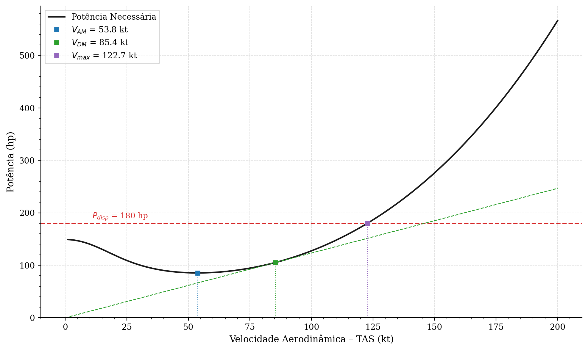
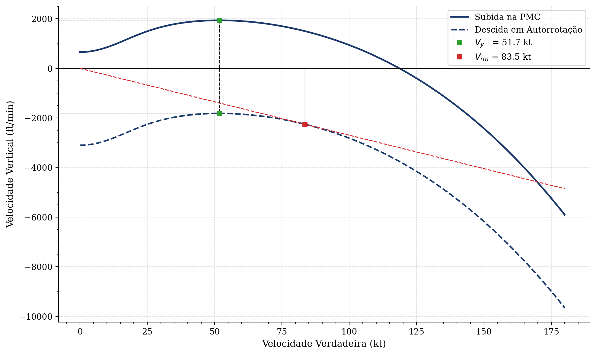
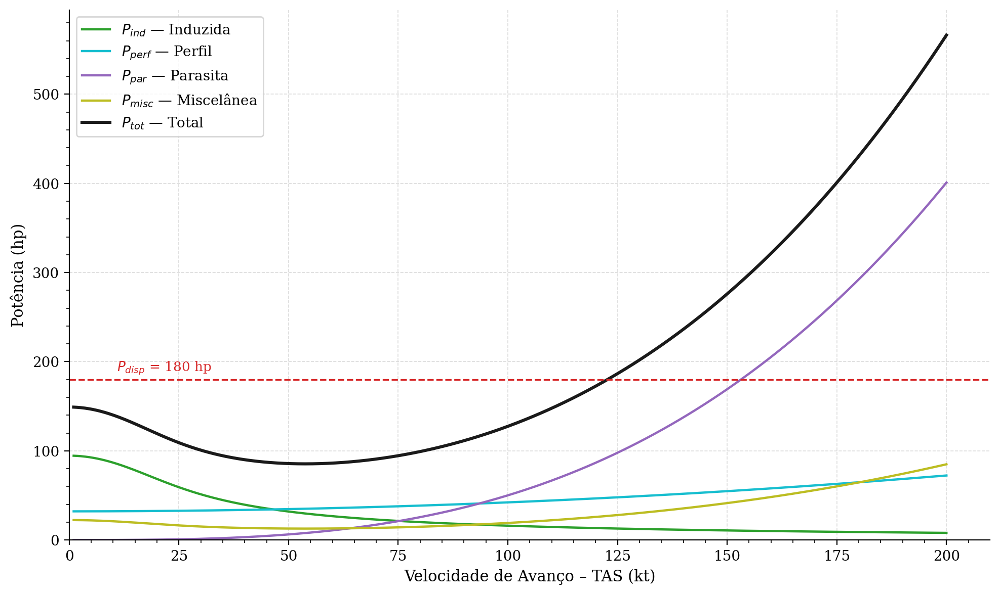
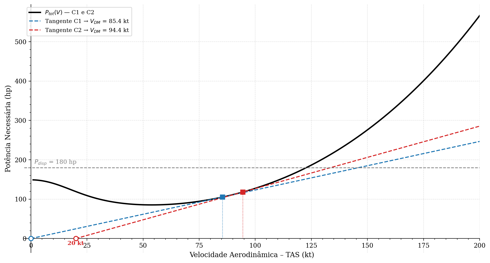
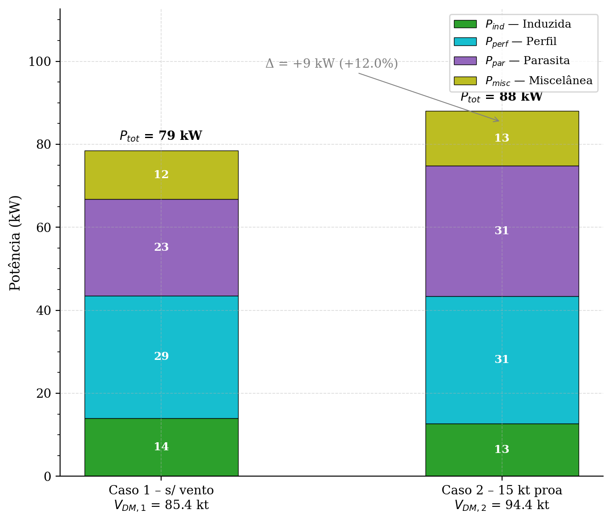

# PRJ-91 — Laboratório 3: Requisito de Missão
### Helicóptero AlphaOne · ISA+20 · Sistema Imperial

---

## Estrutura do Projeto

```
LAB 03/
├── main.m                        # Ponto de entrada — define os casos e executa a missão
├── README.md
│
├── src/                          # Núcleo da simulação
│   ├── Calcular_Fase.m           # Potências e consumo por fase (preditor-corretor opcional)
│   ├── Analise_Velocidades_Cruzeiro.m  # Curva P(V): VDM, VAM, V_max e decomposição
│   ├── Polar_Velocidade.m        # Polar vertical: Vy, Vvm, Vrm
│   ├── analisar_fase.m           # Orquestrador: Polar + Cruzeiro → VDM, VAM, Vy  ¹
│   └── atribui_fase.m            # Monta struct de missão por fase  ¹
│
├── utils/                        # Utilitários genéricos de suporte
│   ├── ISA.m                     # Modelo de Atmosfera Padrão Internacional
│   ├── Exportar_Resultados.m     # Gera resultado.txt e dados.json por caso
│   └── plotar_caso.py            # Gera os gráficos PNG a partir de dados.json
│
├── config/
│   └── heli_params.json          # Parâmetros do AlphaOne
│
└── results/AlphaOne/
    ├── pdf_results.json          # Valores de referência do relatório PDF
    ├── CASO{1,2}/
    │   ├── resultado.txt         # Tabela de potências, velocidades e consumo
    │   ├── dados.json            # Dados numéricos serializados
    │   ├── Balanco_Fase{2..5}_*.png
    │   ├── Polar_Fase{2..5}_*.png
    │   └── Decomp_Fase{2..5}_*.png
    └── comparacoes/
        ├── Comp_VDM_Tangentes_C1vsC2.png
        └── Comp_Decomp_VDM_C1vsC2.png
```
> ¹ `analisar_fase` e `atribui_fase` existem como arquivos separados em `src/` para compatibilidade com Octave.
> No MATLAB, estão definidas como *local functions* diretamente em `main.m`.

### Descrição dos módulos

| Arquivo | Responsabilidade |
|---|---|
| `main.m` | Define aeronave, casos e parâmetros; executa as 6 fases em sequência |
| `src/Calcular_Fase.m` | Núcleo físico: resolve o iterativo de Glauert, calcula todos os $C_P$, aplica correção IGE e retorna potências + consumo |
| `src/Analise_Velocidades_Cruzeiro.m` | Varre 1–200 kt em voo nivelado; determina VDM (tangente), VAM (mínimo) e $V_\text{max}$ (cruzamento com $P_\text{disp}$) |
| `src/Polar_Velocidade.m` | Constrói o envelope de desempenho vertical; determina $V_y$, $V_{vm}$, $V_{rm}$, $V_{rM}$ |
| `src/analisar_fase.m` | Orquestra Polar + Cruzeiro e monta as structs `polar` e `cruzeiro` para exportação |
| `src/atribui_fase.m` | Monta a struct de missão de cada fase a partir das velocidades notáveis calculadas |
| `utils/ISA.m` | Calcula $\rho$, $T$ e $P$ para qualquer altitude-pressão com desvio $\Delta T_\text{ISA}$ |
| `utils/Exportar_Resultados.m` | Formata e grava `resultado.txt` e `dados.json` por caso |
| `utils/plotar_caso.py` | Lê `dados.json` e gera os gráficos PNG em `results/` |

---

## Aeronave — AlphaOne

Helicóptero leve, monomotor a pistão (Lycoming IO-360-B), rotor principal tripá.

| Parâmetro | Valor |
|---|---|
| MTOW | 1 587 lb |
| Peso vazio | 838 lb |
| Capacidade de combustível | 222 lb |
| Raio do rotor $R$ | 12,63 ft |
| Velocidade de ponta $\Omega R$ | 650,9 ft/s |
| Solidez $\sigma$ | 0,04465 |
| $P_\text{disp}$ (PMC) | 180 hp |
| SFC | 0,450 lb/hp/h |
| Altura do rotor sobre o solo $h$ | 5 ft |

---

## Missão Analisada

A missão completa é composta por seis fases, todas a ISA+20 °C:

| # | Fase | Condição |
|---|---|---|
| 1 | Pairado IGE | 5 min · $Z_p = 0$ ft · $h = 5$ ft acima do solo |
| 2 | Subida na $V_y$ | $V_c = 1000$ fpm · $0 \to 5000$ ft |
| 3 | Nivelado na VDM | Distância de 300 NM · $Z_p = 5000$ ft |
| 4 | Nivelado na VAM | 20 min de reserva · $Z_p = 5000$ ft |
| 5 | Descida na $V_y$ | $V_c = -1000$ fpm · $5000 \to 0$ ft |
| 6 | Pairado IGE | 5 min · $Z_p = 0$ ft · $h = 5$ ft |

**Dois casos** parametrizam a presença de vento de proa:

| Caso | Vento (kt) | Distância (NM) |
|---|---|---|
| 1 | 0 | 300 |
| 2 | −20 (proa) | 300 |

---

## Metodologia

### 1. `utils/ISA.m` — Atmosfera Padrão Internacional com desvio de temperatura

Para uma altitude-pressão $Z_p$ e desvio $\Delta T_\text{ISA}$:

$$T_\text{std} = T_0 + L \cdot Z_p \qquad T_\text{real} = T_\text{std} + \Delta T_\text{ISA}$$

$$P = P_0 \left(\frac{T_\text{std}}{T_0}\right)^{-g/(LR)}, \qquad \rho = \rho_0 \cdot \frac{P/P_0}{T_\text{real}/T_0}$$

> **Hipótese:** o desvio $\Delta T_\text{ISA}$ altera apenas a densidade (via $T_\text{real}$), mantendo a pressão na curva ISA padrão — fisicamente correto em dias quentes ou frios.

---

### 2. `src/Calcular_Fase.m` — Núcleo Aerodinâmico e Consumo

Esta é a função central do projeto. Recebe o estado da aeronave e retorna todas as potências e o peso ao fim da fase.

#### 2.1 Adimensionais de entrada

$$\mu = \frac{V_\text{TAS}}{\Omega R}, \quad \lambda_c = \frac{V_c}{\Omega R}, \quad C_T = \frac{W}{\rho\,A\,(\Omega R)^2}$$

onde $\mu$ é a razão de avanço, $\lambda_c$ o inflow de subida/descida e $C_T$ o coeficiente de tração.

#### 2.2 Iterativo de Glauert — velocidade induzida

A equação implícita de Glauert para $\lambda_i$ é resolvida por ponto-fixo partindo de $v_i^{(0)} = v_h = \sqrt{W/(2\rho A)}$:

$$\lambda_i^{(n+1)} = \frac{C_T/2}{\sqrt{\mu^2 + \left(\lambda_c^\text{iter} + \lambda_i^{(n)}\right)^2}}, \qquad \text{convergência: } |\lambda_i^{(n+1)} - \lambda_i^{(n)}| < 10^{-3}$$

> **Hipótese — descida:** por simplificação do enunciado, usa-se $\lambda_c^\text{iter} = 0$ no iterativo para $V_c < 0$, evitando a região de VRS (*Vortex Ring State*).
> O termo real $\lambda_c C_T$ (negativo) é, porém, mantido na equação de $C_P$ para contabilizar a energia recuperada na descida.

#### 2.3 Decomposição dos coeficientes de potência

$$C_{P,\text{ind}} = k_i \frac{C_T^2}{2\sqrt{\mu^2 + (\lambda_c^\text{iter} + \lambda_i)^2}} \qquad \text{(induzida)}$$

$$C_{P,\text{perf}} = \frac{\sigma\,C_{d0}}{8}\left(1 + 4{,}65\,\mu^2\right) \qquad \text{(perfil)}$$

$$C_{P,\text{par}} = \frac{1}{2}\frac{f}{A}\,\mu^3 \qquad \text{(parasita,}\ \propto V^3\text{)}$$

$$C_{P,\text{vert}} = \lambda_c\,C_T \qquad \text{(subida/descida)}$$

$$C_{P,R} = C_{P,\text{ind}} + C_{P,\text{perf}} + C_{P,\text{par}} + C_{P,\text{vert}}, \qquad C_{P,\text{misc}} = \left(\frac{1}{\eta_m} - 1\right) C_{P,R}$$

> $\eta_m$ agrupa rotor de cauda, transmissão e acessórios — a diferença entre $C_{P,R}$ e $C_{P,\text{motor}} = C_{P,R}/\eta_m$ é dissipada como $C_{P,\text{misc}}$.

#### 2.4 Consumo de combustível

$$\dot{W}_\text{comb} = \text{SFC} \cdot P_{eM}, \qquad W_\text{final} = W - \dot{W}_\text{comb} \cdot \Delta t$$

#### 2.5 Correção de Efeito Solo — método de Prouty

Ativada apenas quando $V < 1$ kt e $h_\text{solo}$ é finito. O fator $k_\text{IGE}$ é interpolado em função da razão altura-diâmetro $z/D$:

$$C_{P,\text{ind}}^\text{IGE} = C_{P,\text{ind}}^\text{OGE} \cdot k_\text{IGE}\!\left(\frac{z}{D}\right), \qquad z = h_\text{solo} + h_\text{rotor},\quad D = 2R$$

Polinômio de grau 4 ajustado aos 9 pontos tabelados de Prouty para $z/D \in [0{,}43,\,1{,}16]$; fora desse intervalo ($z/D \geq 1$) a correção é desprezível.

#### 2.6 Preditor-corretor de peso médio

Ativado por `usar_peso_medio = true`. Corrige o viés de usar o peso inicial em fases longas:

$$W_\text{pred} = W_\text{ini} - \Delta W(W_\text{ini}), \qquad W_\text{med} = \tfrac{1}{2}(W_\text{ini} + W_\text{pred}), \qquad W_\text{final} = W_\text{ini} - \Delta W(W_\text{med})$$

> **Quando usar:** recomendado para fases onde $\Delta W / W \gtrsim 5\%$ (cruzeiros de centenas de NM). Para pairado, subida e descida, peso fixo é suficiente.

---

### 3. `src/Analise_Velocidades_Cruzeiro.m` — Balanço de Potência e Velocidades de Cruzeiro

Varre $V_\text{TAS} \in [1,\,200]$ kt com passo de 0,1 kt em voo nivelado ($V_c = 0$), chamando `Calcular_Fase` em cada ponto.

#### 3.1 Velocidade de Máxima Autonomia (VAM)

Corresponde ao mínimo da curva $P_\text{tot}(V)$, ou seja, o ponto de menor consumo instantâneo:

$$V_\text{AM} = \arg\min_{V}\; P_\text{tot}(V)$$

> Fisicamente: voar na VAM maximiza o tempo de voo para uma dada quantidade de combustível (maior autonomia).

#### 3.2 Velocidade de Distância Máxima (VDM)

Geometricamente é o ponto de tangência da reta partindo da **origem da velocidade-solo** ($V_{GS} = 0 \Rightarrow V_\text{TAS} = -V_\text{vento}$) à curva $P_\text{tot}(V_\text{TAS})$:

$$V_\text{DM} = \arg\min_{V}\; \frac{P_\text{tot}(V)}{V_\text{GS}} = \arg\min_{V}\; \frac{P_\text{tot}(V)}{V + V_\text{vento}}$$

> Com vento de proa ($V_\text{vento} < 0$), a origem desloca-se para a esquerda, empurrando a VDM para uma velocidade maior — o helicóptero deve voar mais rápido para compensar a perda de $V_{GS}$.

#### 3.3 Velocidade Máxima de Voo Nivelado ($V_\text{max}$)

É a maior velocidade para a qual a potência total iguala a disponível:

$$V_\text{max} = \max \{ V : P_\text{tot}(V) = P_\text{disp} \}$$

---

### 4. `src/Polar_Velocidade.m` — Envelope de Performance Vertical

Varre $V_\text{TAS} \in [0,\,180]$ kt com passo de 0,1 kt, calculando a razão vertical em duas condições:

$$v_Z = \frac{P_\text{disp} - P_\text{tot}(V)}{W} \qquad \text{(subida na PMC — excesso de potência específica)}$$

$$v_{Z,\text{auto}} = -\frac{P_\text{tot}(V)}{W} \qquad \text{(autorrotação — motor desligado)}$$

#### 4.1 Velocidades de razão (independem do vento)

| Velocidade | Definição | Cálculo |
|---|---|---|
| $V_y$ | Máxima razão de subida | $\arg\max\; v_Z(V)$ |
| $V_{vm}$ | Mínima razão de descida (autorrotação) | $\arg\max\; v_{Z,\text{auto}}(V)$ (menos negativo) |

#### 4.2 Velocidades de rampa (dependem do vento)

O ângulo de trajetória sobre o solo é $\gamma = v_Z / V_{GS}$, com $V_{GS} = V_\text{TAS} + V_\text{vento}$.
Geometricamente equivale à inclinação da reta que parte da origem $(-V_\text{vento},\, 0)$ e toca a curva:

| Velocidade | Definição | Cálculo |
|---|---|---|
| $V_{rM}$ | Máxima rampa de subida (melhor ângulo de climb) | $\arg\max\; v_Z / V_{GS}$ |
| $V_{rm}$ | Mínima rampa de descida (maior alcance em autorrotação) | $\arg\max\; v_{Z,\text{auto}} / V_{GS}$ |

> **Hipótese numérica:** pontos com $V_{GS} \leq 5$ kt são filtrados ($\gamma \to -\infty$) para evitar instabilidade numérica próxima à origem das retas tangentes.

---

### 5. `src/analisar_fase.m` — Orquestrador por Fase

Chama `Polar_Velocidade` e `Analise_Velocidades_Cruzeiro` em sequência para uma dada condição de peso/altitude, e consolida os resultados nas structs `polar` e `cruzeiro` exportadas para JSON. Não contém lógica física própria — serve como interface entre o `main.m` e os módulos de análise.

---

## Resultados

### Tabela-síntese dos 2 casos

| Caso | Vento | Dist. | Comb. gasto (lb) | Margem (lb) | Potência | Combustível |
|---|---|---|---|---|---|---|
| 1 | 0 kt | 300 NM | 190,38 | +31,62 | ✅ | ✅ |
| 2 | −20 kt | 300 NM | 236,41 | −14,41 | ✅ | ❌ |

> **Caso 2** — vento de proa reduz $V_{GS}$ → tempo de cruzeiro em F3 aumenta → combustível insuficiente (falta 14,4 lb ≈ 9 L de avgas).

Os valores-referência do relatório PDF (`results/AlphaOne/pdf_results.json`) são usados como baseline de validação: 193,7 lb para o Caso 1 e 196,2 lb para o Caso 2. A diferença no Caso 2 (≈ 40 lb a mais na simulação) é explicada pela VDM calculada ligeiramente inferior (94,4 kt vs 94,7 kt do PDF), que amplifica-se ao longo das 300 NM de cruzeiro.

---

### Caso 1 — Baseline (sem vento)



**Balanço de potência** no cruzeiro nivelado (F3, $Z_p = 5\,000$ ft): a tangente a partir da origem $(V_{GS}=0)$ toca a curva de $P_\text{tot}$ em $V_\text{DM} = 85{,}4$ kt. O mínimo da mesma curva define $V_\text{AM} = 50{,}8$ kt (usada em F4), e o cruzamento com $P_\text{disp} = 180$ hp dá $V_\text{max} \approx 120$ kt.



**Polar de velocidade** na subida (F2, $Z_p = 2\,500$ ft): envelope superior (subida na PMC) com pico em $V_y = 51{,}7$ kt → $V_\text{zmax} \approx 1\,440$ fpm; envelope inferior (autorrotação). Como $V_\text{vento} = 0$, as retas tangentes que definem $V_{rM}$ e $V_{rm}$ partem da origem.



**Decomposição de $P_\text{tot}(V)$**: induzida cai $\propto 1/V$, parasita cresce $\propto V^3$, perfil cresce suavemente $\propto 1 + 4{,}65\mu^2$, miscelânea escala com $P_R$. O mínimo de $P_\text{tot}$ (ponto de $V_\text{AM}$) ocorre na transição entre os regimes induzida-dominada e parasita-dominada.

---

### Figura 1 — Caso 2 vs Caso 1: construção geométrica da VDM com vento de proa



**Pergunta que responde:** *por que $V_\text{DM}$ aumenta com vento de proa?*

Como o peso e a altitude em F3 são iguais entre C1 e C2, a curva $P_\text{tot}(V)$ é **a mesma** nos dois casos (linha preta). O que muda é a **origem** da reta tangente que define o máximo alcance:

- **Caso 1 (sem vento)** — a reta parte de $(0, 0)$ e toca a curva em $V_\text{DM} = 85{,}4$ kt.
- **Caso 2 (20 kt de proa)** — a reta parte de $(-20, 0)$, ou seja, do ponto em que $V_{GS} = 0$. Para ter a mesma inclinação mínima ($P/V_{GS}$), ela precisa tocar a curva em ponto de $V$ **maior**: $V_\text{DM} = 94{,}4$ kt.

$$\frac{d}{dV}\left(\frac{P_\text{tot}(V)}{V + V_\text{vento}}\right) = 0 \iff \text{tangência à origem }(-V_\text{vento},\,0)$$

> **Conclusão didática:** o conceito "máximo alcance em relação ao solo" equivale a encontrar a menor razão potência-por-unidade-de-$V_{GS}$. Com vento contrário, o piloto deve voar mais rápido no ar para que o solo passe mais rápido por baixo. O deslocamento da VDM é proporcional à intensidade do vento — aqui, ≈ 9 kt de aumento para 20 kt de proa.

---

### Figura 2 — Caso 2 vs Caso 1: decomposição da potência em $V_\text{DM}$



**Pergunta que responde:** *voar na $V_\text{DM}$ maior (imposta pelo vento de proa) custa mais potência — quem sobe e quem cai?*

Enquanto a Figura 1 mostra **onde** está cada $V_\text{DM}$ pela construção geométrica das tangentes, esta figura mostra **o que custa** voar lá. Valores extraídos em cada ponto ótimo:

| Componente | Caso 1 ($V_\text{DM,1}=85{,}4$ kt) | Caso 2 ($V_\text{DM,2}=94{,}4$ kt) | Δ |
|---|---:|---:|---:|
| $P_\text{ind}$ (induzida, $\propto 1/V$) | 12,6 kW | 11,0 kW | **−12,4%** (cai com $V$) |
| $P_\text{perf}$ (perfil, $\propto 1+4{,}65\mu^2$) | 29,5 kW | 30,7 kW | +4,1% |
| $P_\text{par}$ (parasita, $\propto V^3$) | 23,3 kW | 31,4 kW | **+35,0%** (domina) |
| $P_\text{misc}$ | 11,5 kW | 12,9 kW | +11,9% |
| **$P_\text{tot}$** | **76,8 kW** | **86,0 kW** | **+12,0% (+9,2 kW)** |

O aumento de $V_\text{DM}$ é dominado pela **parcela parasita** ($+8{,}1$ kW), **parcialmente compensada** pela queda da induzida ($-1{,}6$ kW) — o restante se reparte entre perfil e miscelânea.

> **Conclusão didática:** a $V_\text{DM}$ premia voar mais rápido justamente porque o ganho em $V_{GS}$ compensa o tempo adicional que o vento de proa impõe. Não é "potência de graça": o helicóptero queima $+9{,}2$ kW instantâneos, mas cobre a mesma distância no solo em menos tempo. Quando a distância é fixa (como em F3), a integral $P \cdot t$ aumenta, o que explica o estouro de tanque do Caso 2 (−14,4 lb).

---

## Dependências

- **MATLAB** ≥ R2020a  **ou**  **GNU Octave** ≥ 6.0
- Nenhuma toolbox adicional é requerida

## Execução

**MATLAB** (a partir da raiz do projeto):
```matlab
main
```

**Octave** (a partir da raiz do projeto):
```bash
octave --no-gui --eval "run('main.m')"
```

Os resultados são gravados em `results/AlphaOne/CASO{1,2}/resultado.txt` e `dados.json`.
Para gerar os gráficos PNG após a simulação:
```bash
python3 utils/plotar_caso.py
```
