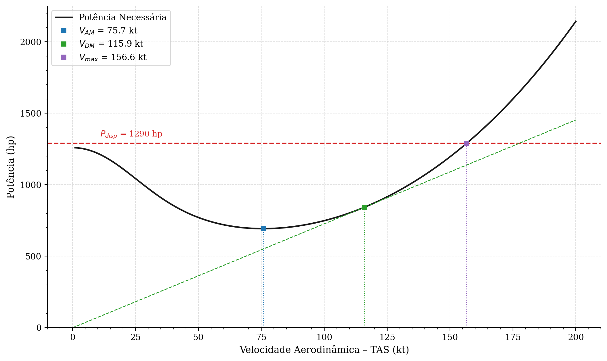
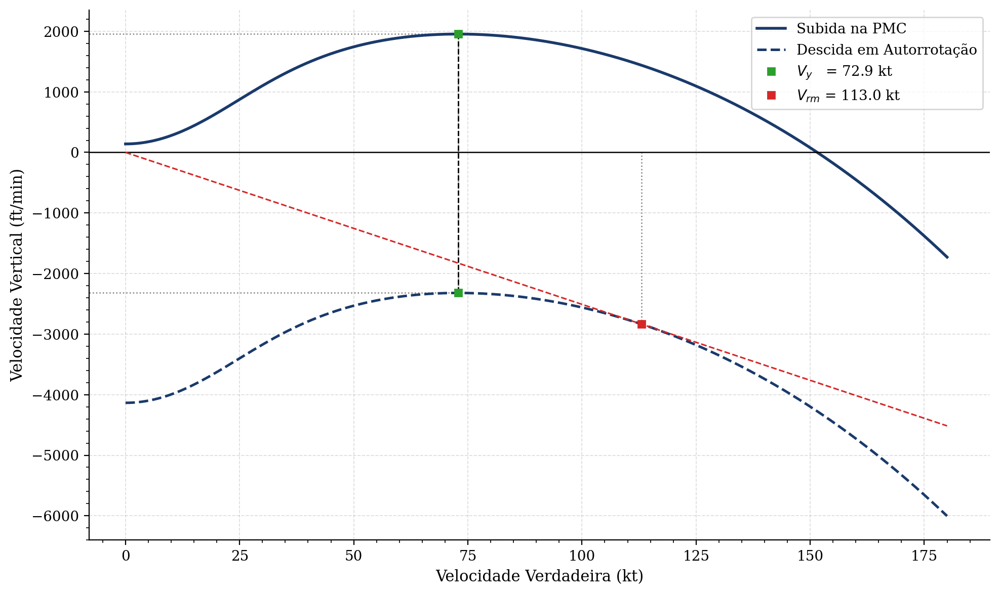
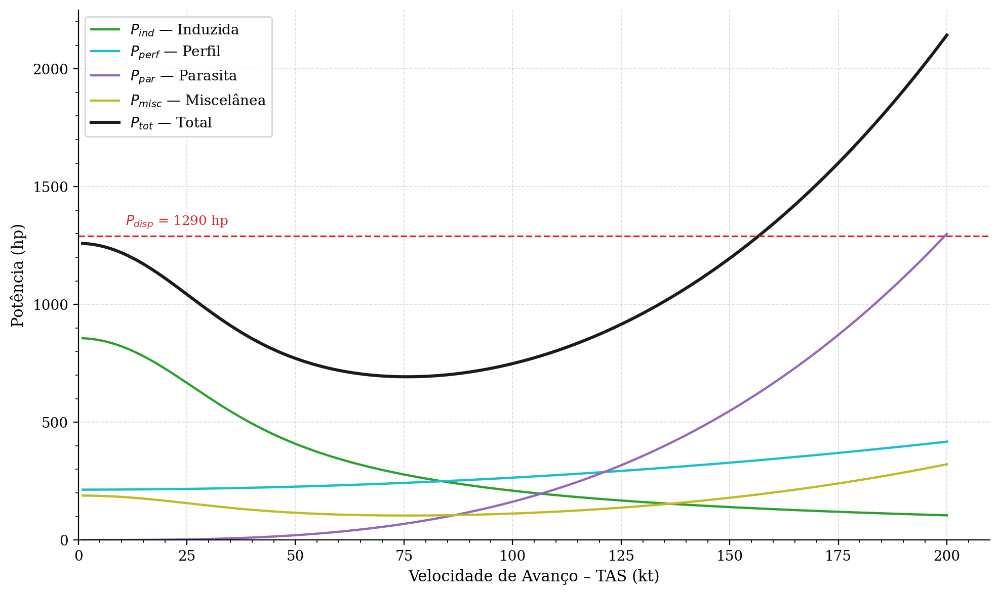

# PRJ-91 — Laboratório 3: Requisito de Missão
### Helicóptero AH-1S Cobra · ISA+20 · Sistema Imperial

---

## Estrutura do Projeto

```
LAB 03/
├── main.m                        # Ponto de entrada — define os casos e executa a missão
├── README.md
│
├── src/                          # Núcleo da simulação
│   ├── Calcular_Fase.m           # Potências e consumo por fase (preditor-corretor opcional)
│   ├── Analise_Velocidades_Cruzeiro.m  # Curva P(V): VDM, VAM, V_max e decomposição
│   ├── Polar_Velocidade.m        # Polar vertical: Vy, Vvm, Vrm
│   ├── analisar_fase.m           # Orquestrador: Polar + Cruzeiro → VDM, VAM, Vy  ¹
│   └── atribui_fase.m            # Monta struct de missão por fase  ¹
│
├── utils/                        # Utilitários genéricos de suporte
│   ├── ISA.m                     # Modelo de Atmosfera Padrão Internacional
│   ├── Exportar_Resultados.m     # Gera resultado.txt e dados.json por caso
│   └── plotar_caso.py            # Gera os gráficos PNG a partir de dados.json
│
├── config/
│   ├── heli_params.json          # Parâmetros do AH-1S Cobra
│   └── heli_params_alphaone.json # Parâmetros do AlphaOne
│
└── results/AH1S/
    └── CASO{1..4}/
        ├── resultado.txt         # Tabela de potências, velocidades e consumo
        ├── dados.json            # Dados numéricos serializados
        ├── Balanco_Fase{2..5}_*.png  # Curva P(V) com VDM/VAM e decomposição
        └── Polar_Fase{2..5}_*.png    # Polar de velocidade vertical
```
> ¹ `analisar_fase` e `atribui_fase` existem como arquivos separados em `src/` para compatibilidade com Octave.
> No MATLAB, estão definidas como *local functions* diretamente em `main.m`.

### Descrição dos módulos

| Arquivo | Responsabilidade |
|---|---|
| `main.m` | Define aeronave, casos e parâmetros; executa as 6 fases em sequência |
| `src/Calcular_Fase.m` | Núcleo físico: resolve o iterativo de Glauert, calcula todos os $C_P$, aplica correção IGE e retorna potências + consumo |
| `src/Analise_Velocidades_Cruzeiro.m` | Varre 1–200 kt em voo nivelado; determina VDM (tangente), VAM (mínimo) e $V_\text{max}$ (cruzamento com $P_\text{disp}$) |
| `src/Polar_Velocidade.m` | Constrói o envelope de desempenho vertical; determina $V_y$, $V_{vm}$, $V_{rm}$, $V_{rM}$ |
| `src/analisar_fase.m` | Orquestra Polar + Cruzeiro e monta as structs `polar` e `cruzeiro` para exportação |
| `src/atribui_fase.m` | Monta a struct de missão de cada fase a partir das velocidades notáveis calculadas |
| `utils/ISA.m` | Calcula $\rho$, $T$ e $P$ para qualquer altitude-pressão com desvio $\Delta T_\text{ISA}$ |
| `utils/Exportar_Resultados.m` | Formata e grava `resultado.txt` e `dados.json` por caso |
| `utils/plotar_caso.py` | Lê `dados.json` e gera os gráficos PNG em `results/` |

---

## Missão Analisada

A missão completa é composta por seis fases, todas a ISA+20 °C:

| # | Fase | Condição |
|---|---|---|
| 1 | Pairado IGE | 5 min · $Z_p = 0$ ft · $h = 6$ ft acima do solo |
| 2 | Subida na $V_y$ | $V_c = 1000$ fpm · $0 \to 5000$ ft (Caso 3: 2000 fpm) |
| 3 | Nivelado na VDM | Distância de 400 NM · $Z_p = 5000$ ft (Caso 4: 440 NM) |
| 4 | Nivelado na VAM | 30 min de reserva · $Z_p = 5000$ ft |
| 5 | Descida na $V_y$ | $V_c = -1000$ fpm · $5000 \to 0$ ft |
| 6 | Pairado IGE | 5 min · $Z_p = 0$ ft · $h = 6$ ft |

**Quatro casos** parametrizam vento, distância e razão de subida:

| Caso | Vento (kt) | Distância (NM) | $V_c$ subida (fpm) |
|---|---|---|---|
| 1 | 0 | 400 | 1 000 |
| 2 | −15 (proa) | 400 | 1 000 |
| 3 | 0 | 400 | 2 000 |
| 4 | 0 | 440 | 1 000 |

---

## Metodologia

### 1. `utils/ISA.m` — Atmosfera Padrão Internacional com desvio de temperatura

Para uma altitude-pressão $Z_p$ (ft) e desvio $\Delta T_\text{ISA}$ (°C), o modelo de troposfera usa:

$$T_\text{std} = T_0 + L \cdot Z_{p,m} \qquad \text{(temperatura padrão, base para a pressão)}$$

$$T_\text{real} = T_\text{std} + \Delta T_\text{ISA} \qquad \text{(temperatura real, base para a densidade)}$$

$$P = P_0 \left(\frac{T_\text{std}}{T_0}\right)^{-g/(LR)}, \qquad \sigma_\rho = \frac{P/P_0}{T_\text{real}/T_0}, \qquad \rho = \rho_0 \cdot \sigma_\rho$$

Constantes: $T_0 = 288{,}15$ K, $P_0 = 101\,325$ Pa, $\rho_0 = 0{,}0023769$ slug/ft³, $L = -0{,}0065$ K/m.

> **Hipótese:** modelo de troposfera válido até $\approx 36\,000$ ft; não inclui tropopausa nem estratosfera.
> O desvio $\Delta T_\text{ISA}$ altera apenas a densidade (via $T_\text{real}$), mantendo a pressão na curva ISA padrão — isso é fisicamente correto em dias quentes/frios.

---

### 2. `src/Calcular_Fase.m` — Núcleo Aerodinâmico e Consumo

Esta é a função central do projeto. Recebe o estado da aeronave e retorna todas as potências e o peso ao fim da fase.

#### 2.1 Adimensionais de entrada

$$\mu = \frac{V_\text{TAS}}{\Omega R}, \quad \lambda_c = \frac{V_c}{\Omega R}, \quad C_T = \frac{W}{\rho\,A\,(\Omega R)^2}$$

onde $\mu$ é a razão de avanço, $\lambda_c$ o inflow de subida/descida e $C_T$ o coeficiente de tração.

#### 2.2 Iterativo de Glauert — velocidade induzida

A equação implícita de Glauert para $\lambda_i$ é resolvida por ponto-fixo partindo de $v_i^{(0)} = v_h = \sqrt{W/(2\rho A)}$:

$$\lambda_i^{(n+1)} = \frac{C_T/2}{\sqrt{\mu^2 + \left(\lambda_c^\text{iter} + \lambda_i^{(n)}\right)^2}}, \qquad \text{convergência: } |\lambda_i^{(n+1)} - \lambda_i^{(n)}| < 10^{-3}$$

> **Hipótese — descida:** por simplificação do enunciado, usa-se $\lambda_c^\text{iter} = 0$ no iterativo para $V_c < 0$, evitando a região de VRS (*Vortex Ring State*).
> O termo real $\lambda_c C_T$ (negativo) é, porém, mantido na equação de $C_P$ para contabilizar a energia recuperada na descida.

#### 2.3 Decomposição dos coeficientes de potência

$$C_{P,\text{ind}} = k_i \frac{C_T^2}{2\sqrt{\mu^2 + (\lambda_c^\text{iter} + \lambda_i)^2}} \qquad \text{(induzida)}$$

$$C_{P,\text{perf}} = \frac{\sigma\,C_{d0}}{8}\left(1 + 4{,}65\,\mu^2\right) \qquad \text{(perfil — arrasto das pás)}$$

$$C_{P,\text{par}} = \frac{1}{2}\frac{f}{A}\,\mu^3 \qquad \text{(parasita — arrasto da fuselagem, } \propto V^3 \text{)}$$

$$C_{P,\text{vert}} = \lambda_c\,C_T \qquad \text{(subida/descida — negativo em descida)}$$

$$C_{P,R} = C_{P,\text{ind}} + C_{P,\text{perf}} + C_{P,\text{par}} + C_{P,\text{vert}} \qquad \text{(potência total ao rotor)}$$

$$C_{P,\text{misc}} = \left(\frac{1}{\eta_m} - 1\right) C_{P,R}, \qquad C_{P,\text{motor}} = \frac{C_{P,R}}{\eta_m} \qquad \text{(eficiência mecânica)}$$

> $\eta_m$ agrupa rotor de cauda, transmissão e acessórios. Qualquer potência além de $C_{P,R}$ é dissipada como $C_{P,\text{misc}}$.

#### 2.4 Conversão de $C_P$ para potência dimensional

$$P\ [\text{kW}] = \underbrace{\rho\,A\,(\Omega R)^3}_{\text{fator adimensional}} \cdot C_P \cdot \underbrace{\frac{1}{550}}_{\text{ft·lbf/s → hp}} \cdot \underbrace{0{,}7457}_{\text{hp → kW}}$$

#### 2.5 Consumo de combustível

$$\dot{W}_\text{comb} = \text{SFC} \times P_{eM}\,[\text{hp}] \quad [\text{lb/h}]$$

$$W_\text{final} = W - \dot{W}_\text{comb} \times \frac{\Delta t_\text{min}}{60}$$

#### 2.6 Correção de Efeito Solo — método de Prouty

Ativada apenas quando $V < 1$ kt e $h_\text{solo}$ é finito ($\ne \infty$). O fator $k_\text{IGE}$ é interpolado a partir dos dados experimentais de Prouty pela razão altura-diâmetro $z/D$:

$$C_{P,\text{ind}}^\text{IGE} = C_{P,\text{ind}}^\text{OGE} \cdot k_\text{IGE}\!\left(\frac{z}{D}\right), \qquad z = h_\text{solo} + h_\text{rotor},\quad D = 2R$$

O polinômio de grau 4 é ajustado aos 9 pontos tabelados de Prouty no intervalo $z/D \in [0{,}43,\,1{,}16]$. Fora desse intervalo ($z/D \geq 1$), nenhuma correção é aplicada (efeito solo desprezível).

#### 2.7 Preditor-corretor de peso médio

Ativado por `usar_peso_medio = true`. Corrige o viés de usar o peso inicial para toda a fase:

$$W_\text{pred} = W_\text{ini} - \Delta W(W_\text{ini}) \qquad \text{(1ª passagem — preditor)}$$

$$W_\text{med} = \frac{W_\text{ini} + W_\text{pred}}{2} \qquad \text{(peso médio estimado)}$$

$$W_\text{final} = W_\text{ini} - \Delta W(W_\text{med}) \qquad \text{(2ª passagem — corretor)}$$

> **Quando usar:** recomendado para fases onde $\Delta W / W \gtrsim 5\%$ (tipicamente cruzeiro de centenas de NM).
> Para pairado, subida e descida, peso fixo é suficiente ($\Delta W / W \lesssim 1\%$).

---

### 3. `src/Analise_Velocidades_Cruzeiro.m` — Balanço de Potência e Velocidades de Cruzeiro

Varre $V_\text{TAS} \in [1,\,200]$ kt com passo de 0,1 kt em voo nivelado ($V_c = 0$), chamando `Calcular_Fase` em cada ponto.

#### 3.1 Velocidade de Máxima Autonomia (VAM)

Corresponde ao mínimo da curva $P_\text{tot}(V)$, ou seja, o ponto de menor consumo instantâneo:

$$V_\text{AM} = \arg\min_{V}\; P_\text{tot}(V)$$

> Fisicamente: voar na VAM maximiza o tempo de voo para uma dada quantidade de combustível (maior autonomia).

#### 3.2 Velocidade de Distância Máxima (VDM)

Geometricamente é o ponto de tangência da reta partindo da **origem da velocidade-solo** ($V_{GS} = 0 \Rightarrow V_\text{TAS} = -V_\text{vento}$) à curva $P_\text{tot}(V_\text{TAS})$:

$$V_\text{DM} = \arg\min_{V}\; \frac{P_\text{tot}(V)}{V_\text{GS}} = \arg\min_{V}\; \frac{P_\text{tot}(V)}{V + V_\text{vento}}$$

> Com vento de proa ($V_\text{vento} < 0$), a origem desloca-se para a esquerda, empurrando a VDM para uma velocidade maior — o helicóptero deve voar mais rápido para compensar a perda de $V_{GS}$.

#### 3.3 Velocidade Máxima de Voo Nivelado ($V_\text{max}$)

É a maior velocidade para a qual $P_\text{tot}(V) \leq P_\text{disp}$. Encontrada por interpolação linear no cruzamento entre $\delta_P = P_\text{disp} - P_\text{tot}$ e zero:

$$V_\text{max} = \text{interp1}\!\left(\delta_P,\, V_\text{TAS},\, 0\right) \quad \text{na última passagem de } \delta_P \geq 0 \to \delta_P < 0$$

---

### 4. `src/Polar_Velocidade.m` — Envelope de Performance Vertical

Varre $V_\text{TAS} \in [0,\,180]$ kt com passo de 0,1 kt, calculando para cada ponto a razão vertical em duas condições:

$$v_Z(V) = \frac{(P_\text{disp} - P_\text{tot})\,[\text{hp}] \times 33\,000}{W\,[\text{lb}]} \quad [\text{fpm}] \qquad \text{(envelope de subida — com motor na PMC)}$$

$$v_{Z,\text{auto}}(V) = \frac{-P_\text{tot}(V)\,[\text{hp}] \times 33\,000}{W\,[\text{lb}]} \quad [\text{fpm}] \qquad \text{(autorrotação — motor desligado)}$$

> O fator 33 000 converte hp para ft·lb/min; dividido por $W$ [lb] resulta em ft/min de razão vertical.

#### 4.1 Velocidades de razão (independem do vento)

| Velocidade | Definição | Cálculo |
|---|---|---|
| $V_y$ | Máxima razão de subida | $\arg\max\; v_Z(V)$ |
| $V_{vm}$ | Mínima razão de descida (autorrotação) | $\arg\max\; v_{Z,\text{auto}}(V)$ (menos negativo) |

#### 4.2 Velocidades de rampa (dependem do vento)

O ângulo de trajetória sobre o solo é $\gamma = v_Z / V_{GS}$, com $V_{GS} = V_\text{TAS} + V_\text{vento}$.
Geometricamente equivale à inclinação da reta que parte da origem $(-V_\text{vento},\, 0)$ e toca a curva:

| Velocidade | Definição | Cálculo |
|---|---|---|
| $V_{rM}$ | Máxima rampa de subida (melhor ângulo de climb) | $\arg\max\; v_Z / V_{GS}$ |
| $V_{rm}$ | Mínima rampa de descida (maior alcance em autorrotação) | $\arg\max\; v_{Z,\text{auto}} / V_{GS}$ |

> **Hipótese numérica:** pontos com $V_{GS} \leq 5$ kt são filtrados ($\gamma \to -\infty$) para evitar instabilidade numérica próxima à origem das retas tangentes.

---

### 5. `src/analisar_fase.m` — Orquestrador por Fase

Chama `Polar_Velocidade` e `Analise_Velocidades_Cruzeiro` em sequência para uma dada condição de peso/altitude, e consolida os resultados nas structs `polar` e `cruzeiro` exportadas para JSON. Não contém lógica física própria — serve como interface entre o `main.m` e os módulos de análise.

---

## Resultados

### Tabela-resumo dos 4 casos

| Caso | Vento | Dist. | $V_c$ sub. | Comb. gasto (lb) | Margem (lb) | Potência | Combustível |
|---|---|---|---|---|---|---|---|
| 1 | 0 kt | 400 NM | 1 000 fpm | 1 554,13 | +129,87 | ✅ | ✅ |
| 2 | −15 kt | 400 NM | 1 000 fpm | 1 735,22 | −51,22 | ✅ | ❌ |
| 3 | 0 kt | 400 NM | 2 000 fpm | 1 541,86 | +142,14 | ❌ | ✅ |
| 4 | 0 kt | 440 NM | 1 000 fpm | 1 675,98 | +8,02 | ✅ | ✅ |

> **Caso 2** — O vento de proa de 15 kt aumenta o tempo de cruzeiro em F3 (VDM de 400 NM com $V_{GS}$ reduzida), tornando o combustível insuficiente.  
> **Caso 3** — A razão de subida de 2 000 fpm exige potência superior à disponível (1 290 hp), inviabilizando a fase de subida.

---

### Balanço de potência — Caso 1, Fase 3 (Nivelado na VDM, 5 000 ft)



A reta tangente partindo da origem toca a curva de potência total no ponto de **VDM = 115,9 kt** (sem vento). O ponto de mínimo da curva, em **VAM ≈ 70,3 kt**, é destacado separadamente e utilizado na Fase 4.

---

### Polar de velocidade — Caso 1, Fase 2 (Subida na $V_y$, 2 500 ft)



A polar mostra a curva de máxima razão de subida (envelope superior) e a curva de autorotação (envelope inferior). A velocidade $V_y = 72{,}9$ kt corresponde ao pico do envelope superior.

---

### Decomposição de potência — Caso 1, Fase 3 (Nivelado na VDM, 5 000 ft)



A decomposição evidencia como cada componente evolui com a velocidade: a potência induzida cai com o aumento de $V$ (efeito do aumento de $\mu$), enquanto a parasita cresce cubicamente. A potência de perfil cresce moderadamente. O ponto de mínimo da curva total coincide com a **VAM ≈ 70,3 kt**.

---

## Dependências

- **MATLAB** ≥ R2020a  **ou**  **GNU Octave** ≥ 6.0
- Nenhuma toolbox adicional é requerida

## Execução

**MATLAB** (a partir da raiz do projeto):
```matlab
main
```

**Octave** (a partir da raiz do projeto):
```bash
octave --no-gui --eval "run('main.m')"
```

Os resultados são gravados em `results/AH1S/CASO{1..4}/resultado.txt` e `dados.json`.
Para gerar os gráficos PNG após a simulação:
```bash
python3 utils/plotar_caso.py --aeronave AH1S
```
